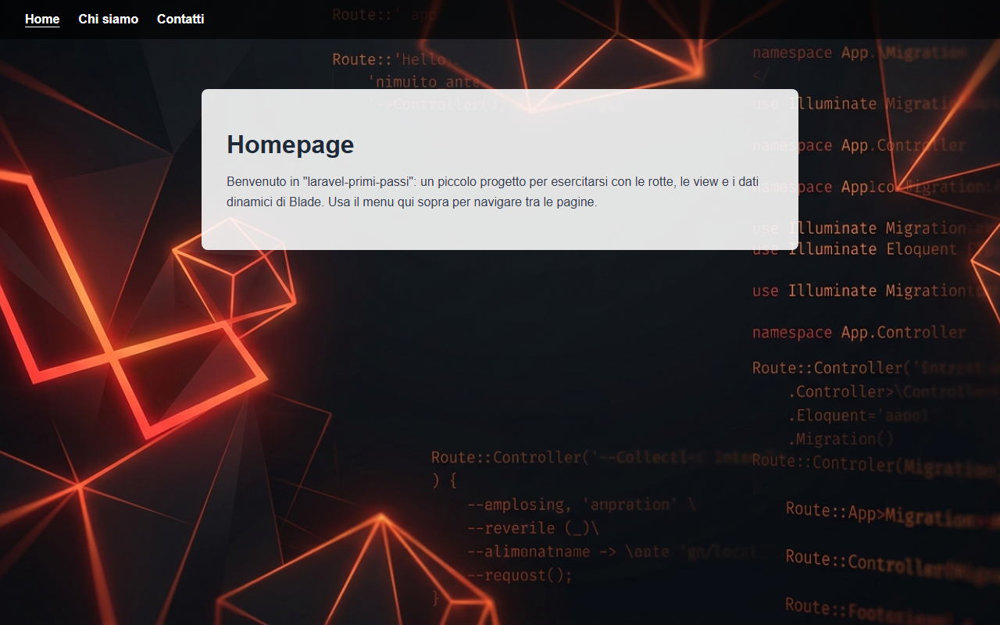
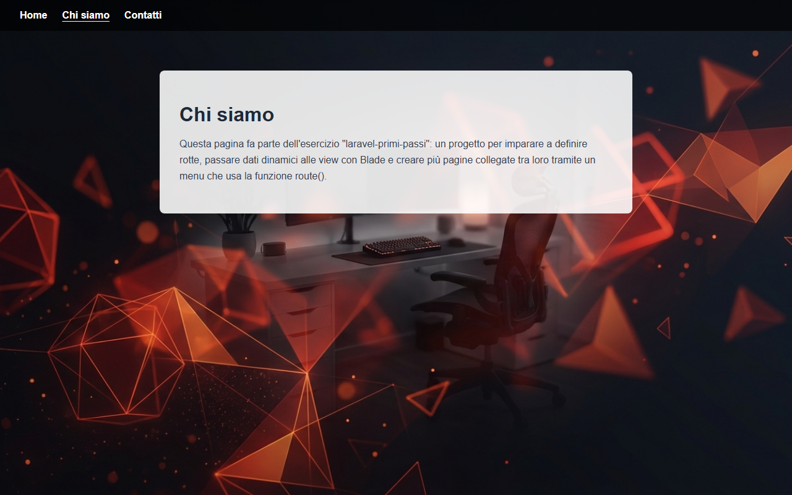
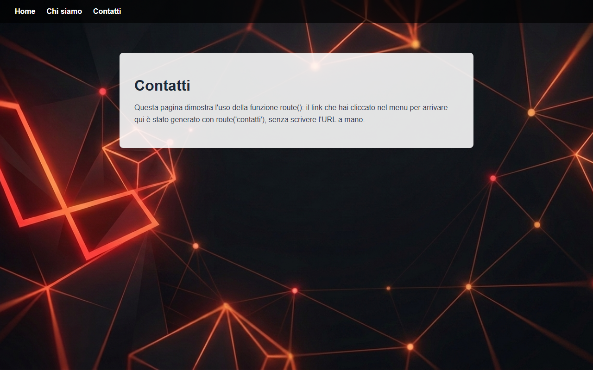

# Laravel Primi Passi

Progetto di esercizio per imparare le basi del **routing** in Laravel: definizione di rotte, passaggio di dati dinamici alle view tramite Blade, creazione di più pagine collegate tra loro e generazione dei link con la funzione `route()`.

## Obiettivi dell'esercizio

- Creare un progetto Laravel da zero
- Sostituire la view di benvenuto predefinita con una homepage personalizzata
- Passare dati dalla rotta alla view e stamparli dinamicamente con Blade
- **Bonus**: creare più pagine e un header con un menu di navigazione, generando i link con `route()`

## Struttura delle pagine

| Rotta | Nome rotta | View | Descrizione |
|---|---|---|---|
| `/` | `home` | `home.blade.php` | Homepage del progetto |
| `/chi-siamo` | `chi-siamo` | `chi-siamo.blade.php` | Descrizione dell'esercizio |
| `/contatti` | `contatti` | `contatti.blade.php` | Dimostrazione pratica di `route()` |

Le rotte sono definite in [routes/web.php](routes/web.php); ogni pagina condivide lo stesso menu di navigazione tramite il partial [resources/views/partials/header.blade.php](resources/views/partials/header.blade.php).

## Screenshot

### Home


### Chi siamo


### Contatti


## Come avviare il progetto

```bash
composer install
cp .env.example .env
php artisan key:generate
php artisan serve
```

L'app sarà disponibile su [http://localhost:8000](http://localhost:8000).

## Tecnologie

- Laravel 12
- Blade templating
- CSS puro (nessun framework, `public/css/style.css`)
